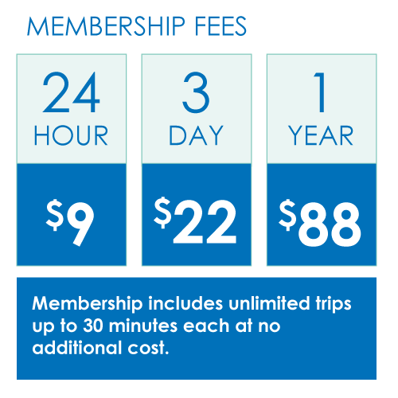
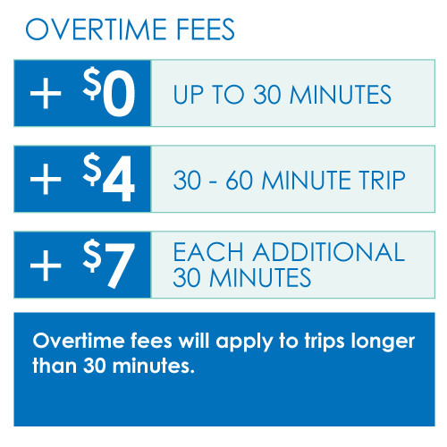

## 1. Executive Summary
Bay Area Bike Share is a membership-based bicycle rental sevice designed for short, quick trips. This short & quick principle is relfected as the 30 minutes ride rule which incurs an additional fee when an individual trip exceeds 30 minutes. The additional fee is relatively expensive as compared to the membership fee so that the system can retain a state of short rentals as intended.

If you look at the data, however, there are not a few trips which exceed 30 minutes. Especially for anual membership users, what is notable is that 60% of additional fee trips fall into 30-45 minutes range which feels like they tried to make it within 30 minutes but couldn't. This type of unintentional overtime, if it’s really so, should be minimized in terms of both customer satisfaction and service design.


## 2. Data
The target range of this data analysis is from March to August 2014.  
The data is retrieved from the link in the official website.  

Bay Area Bike Share official website : [http://www.bayareabikeshare.com/](http://www.bayareabikeshare.com/)  
Data source : [https://s3.amazonaws.com/babs-open-data/babs_open_data_year_1.zip](https://s3.amazonaws.com/babs-open-data/babs_open_data_year_1.zip)  

The zip file contains two ranges of data set and only the latter is used for analysis.  
 - From August 2013 to Feb 2014 *(Not used)*  
 - From March 2014 to August 2014 *(Target of analysis)*  
```{r}
# babs_open_data_year_1.zip
# │
# ├───201402_babs_open_data -------> Not used
# │       201402_station_data.csv
# │       201402_status_data.csv
# │       201402_trip_data.csv
# │       201402_weather_data.csv
# │       README.txt
# │
# └───201408_babs_open_data -------> Target of analysis
#         201408_station_data.csv
#         201408_status_data.csv
#         201408_trip_data_.csv
#         201408_weather_data.csv
#         README.txt
```


## 3. Analysis
### 3.1 Data Load and Preparation
First let's load the target csv file into R and simplify column names. Here, I only load trip data "201408_trip_data.csv". The column "duration" in the csv file is recorded in second so I add "duration.m" which is minute representation of trip time.
```{r, message=F, warning=F}
# Load trip data
trip <- read.csv('./input/201408_trip_data.csv', 
                 colClasses=c('integer', 'integer', 'character', 'character',
                              'integer', 'character', 'character', 'integer',
                              'integer', 'character', 'character'))
# Rename columns
names(trip) <- c('id', 'duration', 's.date', 's.station',
                 's.terminal', 'e.date', 'e.station', 'e.terminal',
                 'bike', 'type', 'zip')
# Add minutes version of duration
trip$duration.m <- trip$duration / 60
```
```{r}
# [Definition of trip]
#   id          : trip ID number
#   duration    : time of trip in seconds
#   s.date      : start date of trip with date and time, in PST
#   s.station   : station name of start station
#   s.terminal  : numeric reference for start station
#   e.date      : end date of trip with date and time, in PST
#   e.station   : station name for end station
#   e.terminal  : numeric reference for end station
#   bike        : ID of bike used
#   type        : Subscriber = annual member; Customer = 24-hour or 3-day member
#   zip         : Home zip code of user (only available for annual members)
#   duration.m  : time of trip in minutes
str(trip)
```  


### 3.2 Penalty Ride
Next let's look at how many trips exceeded 30 minutes. I call those which exceeded 30 minutes as penalty rides since members had to pay additional fee.
```{r}
# How many trips exceeded 30 mins?
table(trip$duration.m > 30)
# How much propotion of trips exceeded 30 mins?
prop.table(table(trip$duration.m > 30))
```
The first table shows how many trips exceeded 30 minutes and the second one shows the same fact in propotion. Based on these table numbers, we can see that around 10000 trips which correspond to 5.8% of all the trips from March to August 2014 are penalty rides. Is it bad? At this point it's difficult to judge. So let's drill down. What can we see when the data is separated by membership type, Subscriber (annual member) and Customer (24-hour or 3-day member)?  

```{r}
# How many trips exceeded 30 mins by member type?
table(trip$duration.m > 30, trip$type)
# How much propotion of trips (column-wise) exceeded 30 mins by member type?
prop.table(table(trip$duration.m > 30, trip$type), margin=2)
```
Now we can see something interesting. It's similar to the previous pair of talbes though, we can observe a significant difference between membership types. (Note, the propotion in the second table is taken column-wise, meaning it's a propotion within the membership.)  
For Cutomer members, **9000 trips which correspond to 31%** of all Customer trips are penalty rides as compared to the fact that only **900 trips which correspond to 0.6%** of all Subscriber trips are penalty rides. What's going on here? Before proceeding to the contemplation, it might be useful to take a look at the pricing system.
<div>
  
  
</div>
http://www.bayareabikeshare.com/pricing  

From Customer member's viewpoint, for example 24 hour members, they pay $9 and get the privilege to use a bike for 24 hours. Considering the actual trip time which I guess around 3 hours at most (the assumption here is that most of Customer members are tourists), the overtime fee does not feel so expensive.

> $3/**hour** (= $9 for 3 hours)  
> $4 additional fee for 30-60 mins trip  
> $7 additional fee for every 30 mins after 1 hour  

Of course overtime fee is still something that they want to avoid though, they might not feel so bad about it especially if their purpose is just to go around for sightseeing which I guess is the main stream of Customer members. (Personally I think that people are more lenient about spending when they are having fun.)

On the other hand, from Subscriber's viewpoint, the rate is as follows.

> $7.3/**month** (= $88 for 12 months)  
> $4 additional fee for 30-60 mins trip  
> $7 additional fee for every 30 mins after 1 hour  

Now it feels totally different. Do they have to pay $4 which is more than a half of the monthly payment if they exceed 30 minutes? Is it serious that 30 minutes ride costs $7 which is almost the same as the monthly payment if a trip exceeds 1 hour? This is something Subscriber members definitly want to avoid.

So it makes sense that Customer members are more lenient to the overtime fee and that produces such a big difference in the propotion of penalty ride.  


### 3.3 Penalty Ride of Subscriber members
Based on the urgent feeling from Subscriber members, I'd like to drill down Subscriber members' penalty rides further. How does the distribution of trip time look like?
```{r}
# Extract penalty ride of Subscriber
penalty <- trip[trip$duration.m > 30 & trip$type == 'Subscriber', ]
# Visualize distribution (Cut the long tail)
library(ggplot2)
qplot(penalty$duration.m, geom='histogram', binwidth=2, xlim=c(30, 100),
      main='Subscriber members\' penalty rides', xlab='Trip Time (mins)', ylab='Frequency')

```

The graph contains only Subscriber member's trips which exceed 30 minutes. It is highly right skewed and **that skewness feels like a lot of members tried to make it within 30 minutes, but failed.**   

```{r}
# Show propotion of Subscriber members' penalty rides by 15 mins interval
round(prop.table(table(cut(penalty$duration.m, breaks=seq(30, 210, 15)))), 3)
```
The table above shows the propotion of Subscriber members' penalty rides by range of 15 minutes. It shows that **actually 60% of penalty rides of Subscriber members fall into the range from 30 to 45 minutes.**  


## 4. Suggestion
Although it is still unclear that those penalty rides between 30 and 45 minutes of Subscriber members are really unintentional and something they regret, it is very important to know the reasons. So I'd like to suggest a campaign which gathers information from Subscriber members who took a 30-45 minutes trip. This campaign allows us to know more about the reason of penalty ride and help members to avoid additional fee.  

The campaign is on real time basis. It sends email to Subscriber members who took a 30-45 mins trip and ask those members to fill up an online survey. Exemption of the additional fee payment and/or 20% discount for next subscription can be provided as a reward.  

(Example Questions)  
 - Did you intend to exceed 30 minutes before starting the trip? (yes, no)  
 - Did you stop and leave the bike during the trip? (yes, no)  
 - If yes, how many times? (1, 2, 3, more)  
 - How much are you frustrated about the additional fee? (1 - 2 - 3 - 4 - 5)  
 - What was the reason that you had to take the long trip? (Car accident, Bike malfunction, Injury, Theft, Other)  
 - Could you describe a little bit more about the reason? (Free format)  
 - Any comments to us? (Free format)  

The imformation gathered can be used for the future analysis not only to improve customer satisfaction, but also to enhance the design of service. 


## 5. Tools for monitoring
To monitor Subscriber members' penalty rides between 30 and 45 minutes, the following tools have been developed. Those are interactive graphs which you can play around by clicking and dragging.  The basic instruction is as follows.

1. Click "Full-size" link at the upper right conner of the web page. The link leads you to a bigger space of play ground.  
2. Move your cursol over the graph. You can see the details of an element that you are pointing.  
3. If you see too many points and have a difficulty to point a specific element, remove some of them. You can do it by clicking colorful legend at the upper right conner. Click it again when you miss them.  
4. If you want to check a specific location, you can zoom in and move the view. Click an icon of "zoom" or "pan" at the upper right conner then you have a magic hand.  
5. Double clicking on graph always takes you back to a neutral view.  

### 5.1 Which route has more 30-45 minutes' penalty rides? Part 1
https://plot.ly/~watanabe8760/47  
The trip data is aggregated by route (combination of start and end station) and routes which have less than 3 trips are excluded as trivial routes. X-axis is distance between start and end stations and Y-axis is median of trip time. The size of points is adjusted based on the ratio of penalty rides (# of penalty ride / total trip count).  

The diagonal trend, median of trip time increases as distance increases, is something we can easily guess and no question here. What's interesting is the vertical trend on the "x = 0"" line which means trips start and end at the same station. There seems to be not a few penalty rides in those "round trips".  

What's a little intuitive in this graph is that the size of points does not directly express the importance when number of trips is a few. For example, when number of trips is 3, just 1 penalty ride make the ratio 0.33 which is relatively high. To solve this inconvenience, the next graph is introduced.  

### 5.2 Which route has more 30-45 minutes' penalty rides? Part 2
https://plot.ly/~watanabe8760/51  
The data is the same as the previous, jsut the Y-axis changed to total number of trips. What happens is that popular routes float up. If a point keeps his fat even when it floats up, maybe the route (point) has a problem. This float-up strategy solves the inconvenience in the first graph. We can search fatty points in higher position to detect problematic ones.  

As we can see, shorter trips are more pupular and float up as small dot points. But if you look closely at around (2, 60) on the graph, you can find a relatively fatty point which is a route from "Market at 10th"" to "Howard at 2nd". The route has 17 penalty rides out of 63 trips. The ratio is a bit high for the number of trips. What's going on here? Let's look at the details of this route.  

### 5.3 Trip time distribution (Prototype)
https://plot.ly/~watanabe8760/55  
Technically this is just a histogram, not a tool. It plots a distribution of trip time for the route I discussed in the previous tool section. To focus the issue, only trips whose trip time is between 0 and 60 minutes are plotted.  

The distribution has two peaks. Two peaks in one route. This is very interesting and a target of further investigation.  

In the future dropboxes of start and end stations, slide bar of distribution range will be added at the side of graph so that user can interactively create plots accroding to his/her own interest.  

